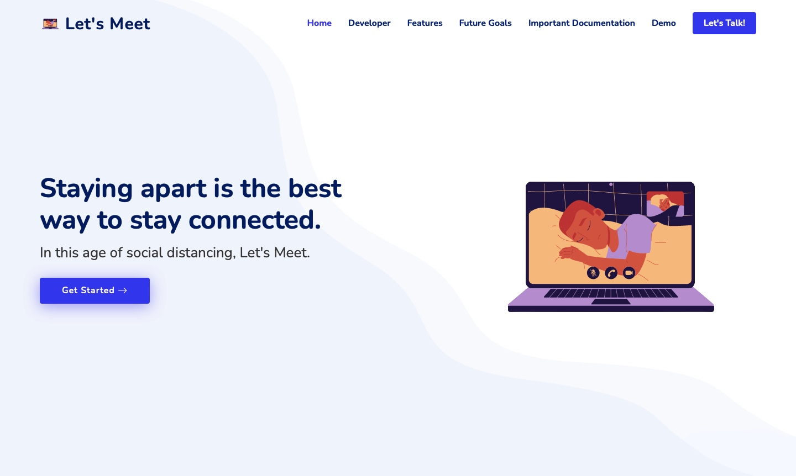
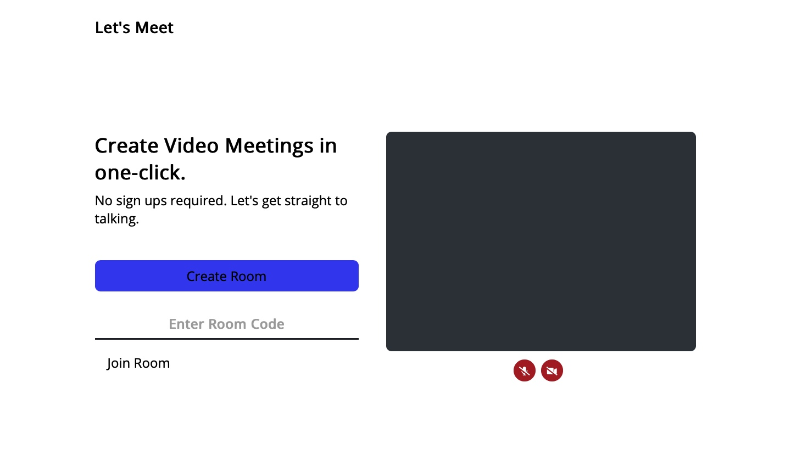
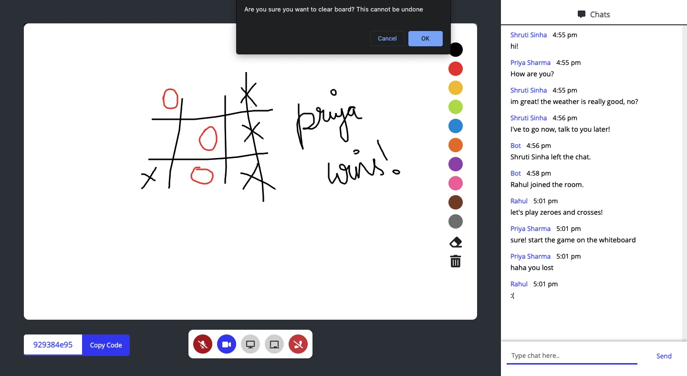
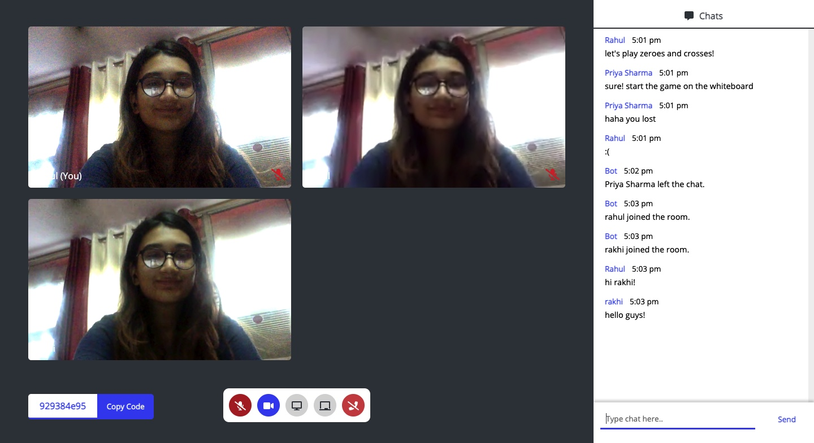

# Chitchat 💻
A Firebase WebRTC Video Chat App 

<h2>Hey! I'm Xitiz Verma! </h2>


In this age of social distancing, Let's Chitchat. 
<br>

In this GitHub repo will use Firebase Cloud Firestore for signalling in a WebRTC Video CHAT Application.
For making the FrontEnd Illustrative we have used CSS Material Design Components.
We will use WebRTC API in our browser and Cloud Firestore as Signaling Server.

The RTC IceCandidate interface—part of the WebRTC API—represents a candidate Interactive Connectivity Establishment (ICE) configuration which may be used to establish an RTCPeerConnection .An ICE candidate describes the protocols and routing needed for WebRTC to be able to communicate with a remote device.

## Steps -

1. For this ,first Create and set up a Firebase project.
2. Enable Cloud Firestore and Create database in the Cloud Firestore pane.
3. Select the Start in test mode.
4. Clone the GitHub repository from the command line:
   ### git clone https://github.com/XitizVerma/Chitchat--Video-Calling-WebRTC-App
5. Install the Firebase Command Line Interface.
   ### npm -g install firebase-tools
   The Firebase Command Line Interface (CLI) allows us to serve our web app locally and deploy our web app to Firebase Hosting.
6. Verify that the CLI has been installed correctly by running the following command:
   ### firebase --version
7. Make sure the version of the Firebase CLI is v6.7.1 or later.
8. Authorize the Firebase CLI by running the following command:
   ### firebase login
9. Associate your app with your Firebase project by running the following command:
   ### firebase use --add
10. When prompted, select your Project ID, then give your Firebase project an alias.
An alias is useful if you have multiple environments (production, staging, etc). However, for this codelab, let's just use the alias of default.
11. You're ready to actually start work on our app! Let's run the app locally!
Run the following Firebase CLI command:
### firebase serve --only hosting

Your command line should display the following response: hosting: Local server: http://localhost:5000
We're using the Firebase Hosting emulator to serve our app locally.

The web app should now be available from http://localhost:5000.
Open your app at http://localhost:5000.

We should see your copy of FirebaseRTC which has been connected to your Firebase project.
The app has automatically connected to your Firebase project.

12. Create a new room
13. Join a new room
14. To stop our NodeJS server from running, we can use the Ctrl+C in the Terminalshortcut which sends the interrupt signal to the Terminal where you start the server.

The development WebRTC server can be accessed by visiting http://localhost:5000.
Running AppRTC locally requires Cloud Firestore Database ,Node.js and compatible Browser.


What I Accomplished
-------------------
We successfully implemented the video calling App wherein more than two people can currently video call together using the web app. We also implemented:
1. Switch audio on/off
2. Switch video on/off
3. Create your own meeting url
4. Join an existing meeting with more than two people
5. Adding own name to profile with which you join the meeting
6. Update whenever somebody joins or leaves the meeting
7. Copy URL in-meeting
8. Chatbox
9. Screenshare
10. Collaborative whiteboard
11. Leave meeting


In the <strong>first two weeks</strong>, We researched on WebRTC, Agora, Jitsi and socket.io to decide on which SDK We wanted to use for our web app. Ended up deciding on WebRTC. Got working on establishing video communication between two connections. <br><br>
In the <strong>third and fourth week</strong>, We worked on adding additional features to our web app. <br><br>
In the <strong>last week</strong>, We ended up adding the chat feature and worked on the landing page as well as the UI for the whole web app.<br><br>


Running the Web App on your Local Device
--------------------------------

To run the web app in your local device, run the following commands in your terminal (macOS) or command prompt (Windows) :-

-Clone the GitHub repository into your local device by running the following command:
```bash
cd folder-you-want-to-download-code-in

git clone https://github.com/shrutayyyy/LetsMeet.git

cd LetsMeet
```
-Now that you're in the project folder, open terminal to download the needed node modules:
```bash
npm install
```
-Now run the server by running the following command:
```bash
npm start
```
The server should be running at <strong>localhost:3000</strong><br>
If localhost:3000 shows busy on your device, run the following commands:
```bash
sudo lsof -i :3000

kill -9 <PID>
```
Now localhost:3000 is free to run this application.
<br>
<br>
-To access the web app, in your project code folder, navigate to public/landing-page and from there open landing.html on any browser of your preference (Chrome recommended for best experience).<br><br>

Technologies Used 
-----------------


1. Node.js
2. HTML 
3. CSS 
4. Bootstrap
5. JavaScript
6. WebRTC
7. Socket.io


Future Possible Functionalities
-------------------------------

1. Add a sign up/authentication page
2. Improve upon the Adapt functionality in the web app
3. Add an additional feature of breakout rooms      
4. Increase Scalability 


Screenshots
-----------------
<br>


<br>


<br>


<br>


<br><br>


